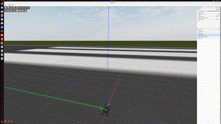

# Drone Simulation

ArduPilot + Gazebo Harmonic + ROS2 Humble 기반 드론 시뮬레이션 프로젝트

## 데모


## 시스템 환경
- OS: Ubuntu 22.04
- ROS2: Humble
- Gazebo: Harmonic (8.x)
- ArduPilot: ArduCopter SITL
- MAVROS2

## 시뮬레이션 실행 순서

### 1. ArduCopter SITL 실행
```bash
cd ~/ardupilot
./build/sitl/bin/arducopter --model JSON --speedup 1 \
  --defaults Tools/autotest/default_params/copter.parm,Tools/autotest/default_params/gazebo-iris.parm \
  --sim-address=127.0.0.1 \
  --sim-port-in=9003 \
  --sim-port-out=9002 \
  -I0
```

### 2. Gazebo 실행
```bash
export DISPLAY=:1
gz sim -v4 ~/ardupilot_gazebo/worlds/iris_runway.sdf
# Gazebo 창에서 ▶ 재생 버튼 클릭
```

### 3. MAVROS2 실행
```bash
ros2 launch mavros apm.launch fcu_url:=tcp://localhost:5760
```

### 4. 드론 이륙 코드 실행
```bash
python3 ~/Drone_project/drone_sim/scripts/takeoff.py
```
